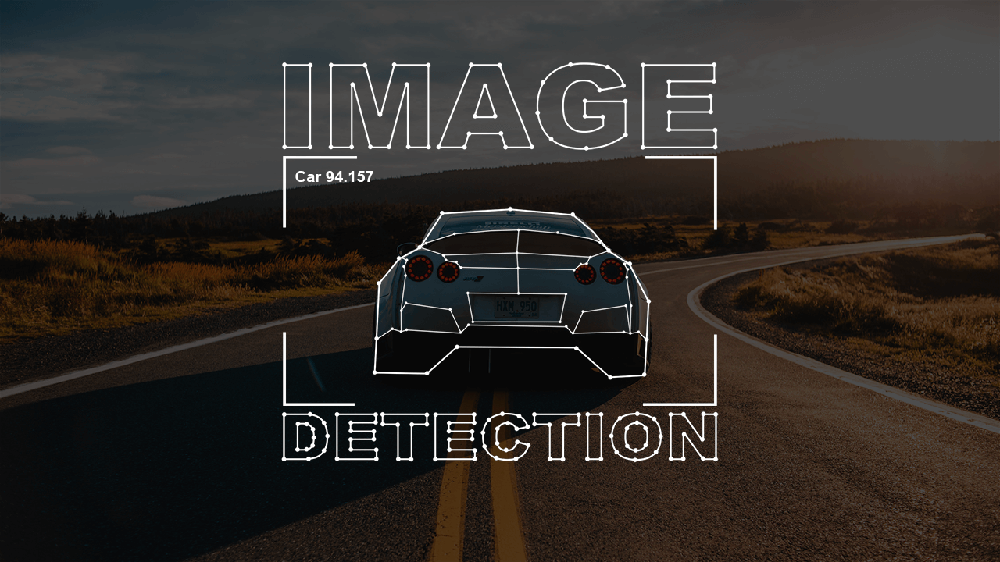
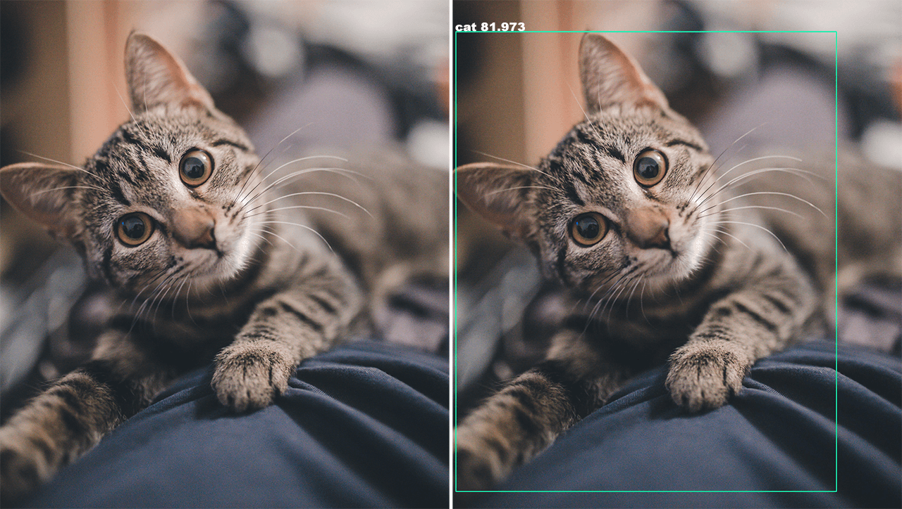
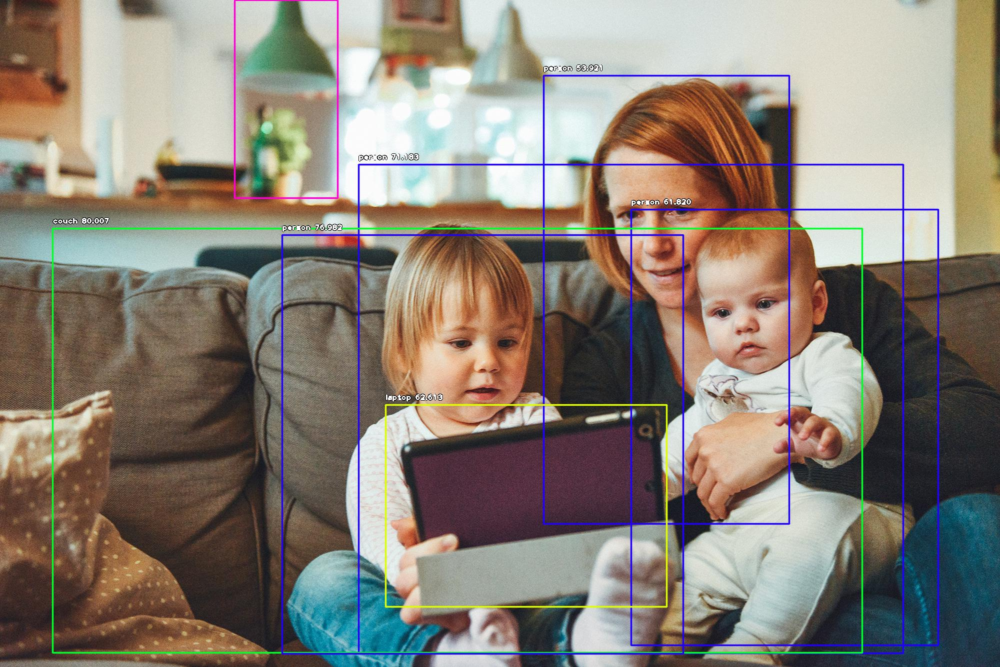
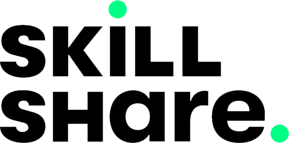

# Create an Image Detection App from Scratch

> In just 20 lines of code you can create an image detection application. It's that easy, seriously.



### Demo



# Get the course on Skillshare



Currently this course is ONLY available on Skillshare at
[https://www.skillshare.com/classes/Create-an-Image-Detection-App-from-Scratch-using-Machine-Learning/2083501919/](https://skl.sh/396PVtH)

### Installation

Want to use this exact code? Go for it! Just make sure you have Python 3.7 or newer installed.

```
git clone https://github.com/KalobTaulien/image-detection
cd image-detection
python -m venv .venv
source .venv/bin/activate
pip install -r requirements.txt
python detection.py  # May need editing to swap out the image
```

Then download [this .h5 file from the ImageAI repo](https://github.com/OlafenwaMoses/ImageAI/releases/download/1.0/resnet50_coco_best_v2.0.1.h5) and move it into your `image-detection` folder.

### The code source
The source code for the packge that performs all the magic behind the scenes can be found at [https://github.com/OlafenwaMoses/ImageAI](https://github.com/OlafenwaMoses/ImageAI)

And the ImageAI docs can be found at [https://imageai.readthedocs.io/en/latest/](https://imageai.readthedocs.io/en/latest/)
